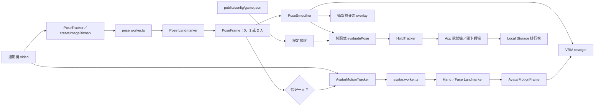

# 開發指南

本文件說明應用程式的架構、資料流、狀態、程式目錄、測試與日常修改方式。遊戲內容與分數規則請搭配[設定檔手冊](CONFIGURATION.md)閱讀。

## 技術組成

| 技術 | 角色 |
| --- | --- |
| Vite | 開發伺服器、Web Worker 打包與正式建置 |
| React 19 | 遊戲畫面與互動狀態 |
| TypeScript | 設定、姿勢資料與模組邊界 |
| MediaPipe Tasks Vision | 產生 33 個身體點、21 點手部資料與臉部 blendshapes |
| Web Worker | 把身體評分追蹤與顯示專用手／臉追蹤移出主執行緒 |
| Three.js + `@pixiv/three-vrm` | 載入並驅動 VRM 虛擬人物 |
| Vitest | 純邏輯單元測試與設定整合測試 |
| Web Audio | 即時合成操作、倒數、過關與完成音效 |
| Local Storage | 儲存這個 origin 的靜音選項與排行榜 |

本專案沒有 API server、資料庫、登入、雲端排行榜、錄影或影像上傳。

## 架構與資料流



重要分界：

- MediaPipe 物件只存在 Worker；主執行緒只接收可序列化的 `PoseFrame` 與 `AvatarMotionFrame`。
- 評分器只依賴 `DetectedPose`、`PoseDefinition` 與門檻，不依賴 React、攝影機或 VRM。
- VRM 的身體顯示使用平滑後骨架；手指與表情另走 `AvatarMotionFrame`。`evaluatePose` 與 `HoldTracker` 沒有這個型別的輸入，因此手／臉資料在結構上無法改變分數。
- VRM 顯示與姿勢評分互不控制。模型看起來正確不代表該關規則一定匹配，反之亦然。
- `game.json` 在使用前會完整驗證；內容錯誤會進入致命錯誤頁，而不是讓錯誤值流入遊戲。

## 遊戲狀態

[`../src/lib/gameState.ts`](../src/lib/gameState.ts) 定義純狀態機：

```text
boot → ready → countdown → playing ↔ transition → complete
  └───────────────────────────────→ error
```

| phase | 說明 | 成績計時 |
| --- | --- | --- |
| `boot` | 載入並驗證設定 | 否 |
| `ready` | 攝影機、全身入鏡與 VRM 準備 | 否 |
| `countdown` | 3、2、1 或設定秒數 | 否 |
| `playing` | 當前姿勢辨識、計分與保持 | 是 |
| `transition` | 過關粒子與傳送門 | 否 |
| `complete` | 暱稱與排行榜 | 否 |
| `error` | 設定等致命初始化錯誤 | 否 |

在 `playing` 期間，即使暫時沒有偵測到人，總成績時間仍持續；只有保持進度會依追蹤寬限暫停或重置。倒數與關卡轉場不計入總時間。跳過按鈕目前在進入該關 8 秒後出現；跳過會繼續流程，但把整局標記為不可寫入排行榜。

狀態機會忽略不符合目前 phase 的舊計時器事件，防止快速重新開始或卸載時發生跳關。

## 姿勢追蹤生命週期

### 攝影機

[`../src/lib/poseTracker.ts`](../src/lib/poseTracker.ts)：

1. 以理想值 1280 × 720、`facingMode: user` 呼叫 `getUserMedia`。
2. 同時啟動 ES module Worker 與開啟攝影機。
3. 依 `poseDetection.maxInferenceFps` 節流。
4. 每次最多只有一個 `ImageBitmap` 推論在途，避免推論較慢時無限堆積影格。
5. 把 bitmap ownership transfer 給 Worker，Worker 完成後關閉 bitmap。
6. 停止時關閉 MediaStream tracks、終止 Worker、清除 video。

Worker 設為 `numPoses: 2`，用途是偵測第二個人，而不是同時讓兩人遊玩：

- 0 人：`noPerson`
- 1 人：進入正常骨架處理
- 2 人：`multiplePeople`，不評分、不累積保持進度

### MediaPipe Worker

[`../src/workers/pose.worker.ts`](../src/workers/pose.worker.ts) 使用：

```ts
FilesetResolver.forVisionTasks(config.wasmPath, true)
```

第二個參數 `true` 很重要：Worker 由 Vite 以 ES module 形式打包，因此需要 module-aware loader 提供 `ModuleFactory`。模型以 `VIDEO` 模式、CPU delegate 執行，輸出 normalized landmarks 與 world landmarks，不輸出 segmentation mask。

Pose／Hand／Face task 與 WASM 都在 `public/` 保留本機副本。公開設定預設使用 Google 官方固定版 Hand／Face 模型，以及與 npm 套件同版的 unpkg WASM，以改善 GitHub Pages 大檔下載速度；攝影機影像仍只在 Worker 本機處理。更新套件時不能只更新 npm 版本而保留不相容的 WASM 或 CDN 版本，詳見[維護手冊](MAINTENANCE.md#更新-mediapipe)。

## 顯示專用手部與臉部追蹤

[`../src/lib/avatarMotionTracker.ts`](../src/lib/avatarMotionTracker.ts) 與 [`../src/workers/avatar.worker.ts`](../src/workers/avatar.worker.ts) 是獨立、可降級的顯示管線：

1. `App` 只在 Pose Landmarker 回傳恰好一個人時，把該人的 `DetectedPose` 交給 `AvatarMotionTracker`。
2. Tracker 依目前畫質選用 `avatarTracking.maxInferenceFps` 或 `lowQualityMaxInferenceFps`，從同一個 video 建立新的 `ImageBitmap`；同一時間最多一幀在途。
3. Avatar Worker 先平行下載 Hand／Face 模型 buffer，再以不同 loader cache key 依序建立兩個 Landmarker。任一功能下載或初始化失敗只回報該 capability／warning，不讓另一個功能或 Pose Worker 失效。
4. Worker 回傳可序列化的 `AvatarMotionFrame`；`VrmPreview` 才把它轉成手指骨旋轉與 expression preset。
5. 沒有人、多人或身體追蹤失效時，App 立即停止提供新的顯示資料。`VrmPreview` 會先維持上一個值 `lostHoldMs`，再將手指與表情平滑放鬆。

Hand／Face task 共用本機 `public/mediapipe/wasm/`。由於 MediaPipe 建立一個 task 後會清除 loader 的 `ModuleFactory`，avatar worker 會為 `hands` 與 `face` 取得 module-aware fileset，並替各自的 `wasmLoaderPath` 加上不同 query cache key。不要移除此隔離，否則第二個 task 可能只在瀏覽器中出現 `ModuleFactory not set.`。

### 全身畫面的手腕 ROI

瑜珈要求頭到腳都入鏡，直接把整張 720p 畫面交給 Hand Landmarker 時，手部像素通常太少。Avatar Worker 會：

1. 從 Pose 的左右手腕、拇指、食指與小指附近點估算兩隻手中心。
2. 以肩寬與 `avatarTracking.hands.roiScale` 決定裁切尺寸，並限制在影像邊界。
3. 把左右 ROI 各放大到 320 × 320，拼成一張 640 × 320 mosaic。
4. 依 mosaic 面板而非 MediaPipe handedness 標籤決定解剖學左右，再把 21 點座標還原到原始畫面。

這個放大只供手指動畫。姿勢評分仍使用 Pose Landmarker 的 33 點，沒有讀取手部 21 點。

### VRM 手指與表情

[`../src/lib/avatarMotion.ts`](../src/lib/avatarMotion.ts) 提供不依賴 DOM 的轉換：

- 用 21 點三點夾角算出五指各關節的彎曲量；鏡像不改變角度。
- 以 VRM normalized hand bones 的 rest direction 推導彎曲軸，從 rest quaternion 插值，避免每幀累加造成漂移。
- 把 Face Landmarker 的 ARKit-like blendshapes 正規化成 VRM `aa`、`ih`、`ou`、`ee`、`oh`、左右眨眼、`happy` 與 `surprised`。
- 嘴型權重會正規化，避免多個母音同時把 morph 過度推高。缺少的 VRM 骨或 expression preset 會略過。

`smoothing` 控制 VRM 插值速度；眨眼的 attack／release 另採 frame-rate independent half-life，降低低 FPS 時忽快忽慢。詳盡參數見[設定檔手冊](CONFIGURATION.md#avatartracking)。

### 評分隔離

`AvatarMotionFrame` 沒有進入 `evaluatePose`、`HoldTracker` 或遊戲狀態機。回歸測試 [`../src/lib/avatarMotionIsolation.integration.test.ts`](../src/lib/avatarMotionIsolation.integration.test.ts) 會在手指與表情資料大幅改變前後比較同一份身體 pose，要求分數完全相同。未來若新增視線、頭部或更細手勢，也必須維持這個 display-only 邊界，除非產品需求明確改變並另行設計評分規則。

### 平滑

[`../src/lib/poseSmoother.ts`](../src/lib/poseSmoother.ts) 對單一人物做指數移動平均：

```text
smoothed = previous + alpha × (current - previous)
```

- 座標 `alpha = 0.35`
- visibility／presence `alpha = 0.5`

較小 alpha 較平順但延遲較高；較大 alpha 反應較快但容易抖動。現在這兩個值是程式常數，不在 `game.json`。沒有偵測到人、偵測多人、資料不完整或重新啟動追蹤時會 reset，避免把不同人物或不同工作階段混在一起。

## 姿勢評分與保持

[`../src/lib/poseEvaluator.ts`](../src/lib/poseEvaluator.ts) 的 `evaluatePose`：

1. 驗證 normalized landmark 至少有 33 點。
2. 收集該姿勢規則用到的點，加上鼻、肩、髖、膝、踝等必要點。
3. 檢查必要點 visibility／presence 與是否位於影像 0–1 範圍。
4. 逐條計算 angle、relative position 或 distance ratio 分數。
5. 使用 `weight` 加權平均。
6. 若 `allowMirrored` 為真，再以左右名稱互換評估一次，取較高總分。
7. 套用當前關卡的分數門檻；分數、可見度與全身入鏡必須同時通過。

當前門檻由 [`resolvePoseScoreThreshold`](../src/lib/config.ts) 決定：

```text
poses[current].scoreThreshold ?? poseDetection.scoreThreshold
```

[`../src/lib/holdTracker.ts`](../src/lib/holdTracker.ts) 只接收「這一幀是否通過」與單調遞增 timestamp。通過時累積；失敗時先暫停。若在 `trackingGraceMs` 內重新通過，暫停區間不計入保持秒數；超過寬限才把本次保持歸零。

完整公式、座標單位與設定範例見[設定檔手冊](CONFIGURATION.md#評分計算)。

## VRM 與鏡像

[`../src/components/VrmPreview.tsx`](../src/components/VrmPreview.tsx)：

- 以 Three.js／VRM Humanoid normalized bones 驅動左右上臂、前臂、大腿、小腿與腳掌。
- 使用明確的骨骼父子鏈取得 rest direction，不依賴不穩定的 `children[0]`。
- MediaPipe 到 VRM 的方向轉換保留解剖學 X 左右，反轉 Y 與 Z。
- 先估算軀幹側傾，再解算四肢，降低父骨骼更新後把手腳帶歪的情況。
- world landmarks 不完整時，預覽可退回 normalized landmarks。

鏡像是兩個不同概念：

| 設定 | 影響 |
| --- | --- |
| `avatar.mirrored` | 只用 CSS 水平翻轉 VRM canvas，讓畫面像鏡子 |
| `poses[].allowMirrored` | 評分時是否把 left/right 關鍵點互換後再算一次 |

攝影機 video 本身以 CSS 鏡像；[`../src/components/SkeletonOverlay.tsx`](../src/components/SkeletonOverlay.tsx) 在座標映射時補上同樣的鏡像與 `object-fit: cover` 裁切。不得為了修正畫面方向而在評分資料中直接交換左右點。

## 程式目錄

```text
.
├─ public/
│  ├─ assets/poses/              姿勢引導圖片
│  ├─ config/game.json           執行階段遊戲設定
│  ├─ mediapipe/wasm/            本機 MediaPipe WASM 與 loader
│  └─ models/                    Pose／Hand／Face task 與 VRM
├─ src/
│  ├─ components/
│  │  ├─ SkeletonOverlay.tsx     鏡像攝影機上的低干擾骨架
│  │  └─ VrmPreview.tsx          VRM 載入、取景、燈光與 retarget
│  ├─ lib/
│  │  ├─ avatarMotion.ts         手指角度、左右與表情純轉換
│  │  ├─ avatarMotionTracker.ts  顯示追蹤 Worker 協調
│  │  ├─ audio.ts                Web Audio 合成音效
│  │  ├─ config.ts               JSON 載入、完整驗證、門檻解析
│  │  ├─ gameState.ts            純遊戲狀態機
│  │  ├─ holdTracker.ts          保持時間與追蹤寬限
│  │  ├─ leaderboard.ts          本機榜單清理、排序與截斷
│  │  ├─ poseEvaluator.ts        純姿勢評分器
│  │  ├─ poseSmoother.ts         EMA 時序平滑
│  │  ├─ poseTracker.ts          Camera／Worker 協調
│  │  └─ vrmRetarget.ts          MediaPipe 到 VRM 方向轉換
│  ├─ workers/
│  │  ├─ avatar.worker.ts        Hand／Face Landmarker 與手腕 ROI
│  │  └─ pose.worker.ts          Pose Landmarker 初始化與推論
│  ├─ App.tsx                    畫面、流程與模組組合
│  ├─ styles.css                 響應式版面與動畫
│  └─ types.ts                   共用資料契約與 33 點名稱
├─ docs/                         開發與維護文件
├─ package.json                  腳本與直接依賴
├─ pnpm-lock.yaml                可重現依賴版本
├─ vite.config.ts               dev／preview／worker 設定
└─ vitest.config.ts             Node 測試環境
```

實際執行使用 `public/models/magic-garden-guide.vrm`。這個檔名用來清楚表示它是遊戲中的魔法花園 3D 引導角色；作者為 NHRI，模型會隨公開 GitHub 專案與 GitHub Pages 網站發布。

## 共用資料契約

[`../src/types.ts`](../src/types.ts) 是模組間契約：

- `Landmark`：`x`、`y`、`z`、`visibility`、可選 `presence`
- `DetectedPose`：normalized `landmarks` 與 `worldLandmarks`
- `PoseFrame`：時間、0–2 個 pose、推論耗時
- `DetectedHand`：解剖學左右、21 點、信心值與更新時間
- `FaceMotion`：Face Landmarker blendshape 名稱到分數的映射
- `AvatarMotionFrame`：顯示專用雙手／臉部資料與推論耗時；與 `PoseFrame` 分離
- `PoseConstraint`：三種判定規則的 discriminated union
- `PoseDefinition`：單一關卡內容、門檻與規則
- `GameConfig`：整份 `game.json`
- `PoseScore`：總分、通過狀態、可見度、入鏡、鏡像結果與逐條分數
- `LeaderboardEntry`：暱稱、毫秒成績、challenge 與完成時間

新增欄位時至少同步更新：

1. `src/types.ts`
2. `src/lib/config.ts`
3. `src/lib/config.test.ts`
4. `public/config/game.json`
5. 使用該欄位的執行程式
6. `docs/CONFIGURATION.md`

不要只對 JSON 做 TypeScript type assertion；設定檔是執行階段外部輸入，必須驗證。

## 開發工作流程

建議每個變更採以下順序：

1. 先確認是「內容設定」還是「程式行為」。能由 `game.json` 表達的姿勢與活動差異，不要硬編碼進 React。
2. 為純邏輯先寫或更新測試。
3. 修改最小範圍程式；不要把 MediaPipe 型別滲入評分器。
4. 執行 `pnpm typecheck` 與 `pnpm test`。
5. 執行 `pnpm build`，確認 Worker 與靜態資產能被正式打包。
6. 以 `pnpm preview` 在 Chrome 與 Edge 做攝影機真人驗收。
7. 更新文件、設定範例與第三方通知。

常用命令：

```bash
pnpm dev
pnpm typecheck
pnpm test
pnpm test:watch
pnpm build
pnpm preview
```

## 測試

Vitest 使用 Node 環境，測試檔位於 `src/**/*.test.ts`。

| 類型 | 目前涵蓋 |
| --- | --- |
| 設定 | 欄位型別與範圍、每關門檻 fallback、重複姿勢 ID、正式 JSON |
| 評分 | 角度、位置、距離、權重、左右鏡像、2D fallback、門檻 |
| 校準 | 樹式示範骨架在不同畫面尺度仍通過 |
| 平滑 | EMA、缺少資料、reset 與不可變性 |
| 保持 | 3 秒、500 ms 寬限、超時重置與單調 timestamp |
| 狀態機 | 倒數、過關、跳過失去排名資格與重新開始 |
| 排行榜 | 名稱清理、同名最快、排序、前十、損壞資料 |
| VRM 轉換 | 左右手腳不交叉、腳鏈、可見度與鏡像不交換骨骼 |
| 手指／表情 | 關節彎曲、左右面板、彎曲軸、blendshape 映射、嘴型正規化與時序平滑 |
| 評分隔離 | 改變手指／臉部資料後，身體姿勢分數保持完全相同 |
| Overlay | `object-fit: cover`、鏡像與不同長寬比 |

Node 測試無法代替：

- 真實攝影機權限與 secure context
- Chrome／Edge 的 MediaPipe WASM 載入
- 全身取景時的真實手腕 ROI、手指遮擋與臉部 blendshape 品質
- 真實兒童不同身高、衣著、光線與活動空間
- WebGL／VRM 左右方向、手指骨與表情 preset
- 降低動態效果與低效能裝置

這些項目必須在發布前手動驗收。

## `poseDebug` 校正模式

開發伺服器：

```text
http://localhost:5173/?poseDebug=1
```

正式預覽：

```text
http://localhost:4173/?poseDebug=1
```

進入遊戲後展開「姿勢判定細節」：

- summary 顯示本關實際門檻。
- 每列顯示規則類型、關鍵點、目標、容錯、提示與目前分數。
- 低於本關門檻的單條規則會標示；總分仍按各規則 `weight` 加權，不能把單列顏色直接當作總通過結果。
- 一般網址不顯示此面板。

校正時應記錄多位測試者的逐條分數，不要只以一位開發者的一次動作調整。完整步驟見[設定檔手冊](CONFIGURATION.md#姿勢校正與-posedebug)。

## `avatarDebug` 顯示驗收模式

開發伺服器：

```text
http://localhost:5173/?avatarDebug=1
```

正式預覽：

```text
http://localhost:4173/?avatarDebug=1
```

此模式由 `App` 合成循環的左右手彎指、眨眼、張嘴與微笑 `AvatarMotionFrame`，方便在沒有可靠手／臉輸入時確認：

- VRM 是否具有標準左右手指骨，且手指朝掌心彎曲。
- 左右手沒有交叉套用。
- 模型是否提供左右／共用眨眼、張嘴 `aa` 與 `happy` expression preset。
- 循環彎指與表情平滑沒有產生跳動。

它刻意不模擬 Hand／Face Landmarker、手腕 ROI、攝影機解析度或效能，也不關閉 Pose Tracker。正式驗收必須移除 query parameter，再以真人逐側張手／握拳、眨單眼、張嘴與微笑；同時確認 `?poseDebug=1` 的分數不會因上述臉手動作改變。

## 新功能設計原則

- 辨識器可替換：轉成 `PoseFrame` 後再交給後續模組。
- 評分器保持純函式：不讀 DOM、時間、攝影機或 Local Storage。
- 時間由 `HoldTracker` 與狀態機處理，不藏在 React 畫面元件。
- 設定可驗證、可測試；不要默默接受拼錯欄位。
- 顯示鏡像不改解剖學資料。
- 手部、臉部、視線或其他裝飾動作預設為 display-only，不得把 `AvatarMotionFrame` 傳進評分器。
- 任何會影響排行榜公平性的計時或評分變更都要新增回歸測試。
- 兒童介面提示應友善、單一、可執行，避免醫療或責備語氣。
